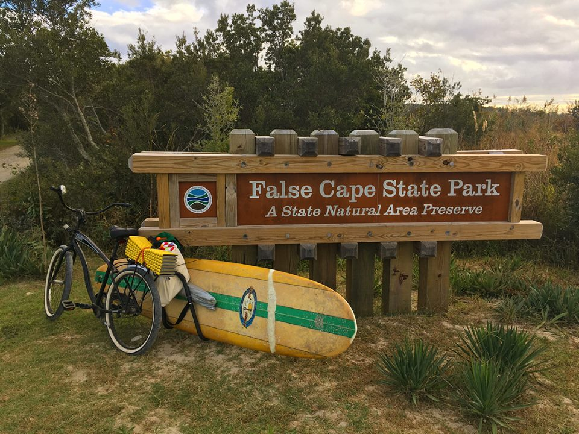

# False Cape Bikepacking
October 2017

## Intro

We just got back from a wonderful weekend bikepacking trip to False Cape State Park in Virginia Beach. I like to do a lot of research when I’m preparing for a trip, but there wasn’t a lot of information about the park available online. Now that the trip is behind us, I thought I’d write up a trip report with some tips that I wish I had known when I was preparing to visit!

## About the park:

False Cape is the southernmost state park in Virginia, and it makes up the southwestern corner of the state. It is a thin strip of land that lies between Back Bay and the Atlantic Ocean. There is no road that goes to the park, so the most common way to get there is to walk or bike through the trails at Back Bay National Wildlife Refuge. Once you’re in the park, there are miles and miles of hiking and biking trails, natural sand dunes, and some great camping sites. There are even some ruins from a settlement that existed in the park up until the early 20th century!

## The Journey:

We loaded our bikes up on the car, drove to Virginia Beach and through Sandbridge, and parked our cars overnight at Little Island State Park. Then we loaded up all of our gear on the bikes, and rode in through Back Bay, past the False Cape visitor center, and on to campsite number 12. All together, the ride in ([Strava link here](https://www.strava.com/)) was about 9 miles and took our group a little over an hour.

Our family brought a variety of bikes – I was riding my Soma Wolverine, Krista was riding a mountain bike, and the rest of our group was on beach cruisers. The trail is mostly hard-packed gravel, but there are a few sections of loose sand. The wider tires definitely helped on the sand – I was running my 40mm gravel tires at the lowest pressure I could, but I still wiped out on the sand.

Once we reached the campsite and set down our stuff, we had just enough time to watch the sunset over the bay (there was a nice little kayak dock just a short walk from our campsite). After that, we retired to our campsite, cooked dinner over my homemade alcohol stove, and played card games until bed time.

## Exploring the Park:

The next morning, we got up with the sunrise, made breakfast, and set out to explore the park. We were hoping to ride our bikes all the way to the North Carolina border, but the trail was a bit too loose and sandy for my 40mm tires to handle, so we headed to the beach instead. To get to the beach, you have to park your bikes at nearby bike racks and then take a short walk over some sand dunes.

Once we got over the sand dunes, we had the whole beach to ourselves! The water temperature was perfect, and we spent some time relaxing in the sand and watching the sand crabs running in and out of their holes.

After an hour or so on the beach, we went back to eat some lunch, pack up our campsite, and make the 9-mile ride back to our car. Our full trip lasted almost exactly 24 hours (so I’m still counting it as a Sub 24 Hour Overnighter).

## Campsites:

The park has 12 total campsites – 6 are on the bay side and 6 are on the ocean side. We chose to stay on the bay side because the spaces were larger. Our site was in a huge field and came with a picnic table and a huge tree that was perfect for our hammock. We pitched our tent on a big sandy patch, which made for a nice soft camping surface.

On our next trip, I definitely want to try camping on the ocean side. Those campers actually get two sites – one small site in the trees and another right on the beach. They can choose where to set up camp, or can use their spot in the trees for cooking and eating and then keep their tent on the beach.

The camping experience itself was great, but definitely primitive. There are pit latrines, but they were clean and well-stocked with TP and hand sanitizer. There is one drinking water spigot in the park, but it was about 3 miles from our campsite. They also do not allow campfires and require everyone to pack out their own trash.

## Things to keep in mind:

There are a few things that I wish someone had told us before we headed out:

- **Be self-supported**: Make sure that you have all the tools you need! We came across a family that was pulling two young children in a trailer and had a flat tire. They were about 10 miles from the nearest road and were very happy that we had tools to share.
- **Pack light**: Everything you bring has to fit on your bike, and the trail in some spots is made up of loose sand, so any unnecessary weight really makes the ride tougher. Our family decided to make it a bit more of a glamping trip (we even brought a surfboard!) so we just took our time on the trails.
- **Double-check your packing list**: We forgot eating vessels, so we had to get creative!
- **Watch out for local critters**: We saw lots of poisonous snakes laying out on the trails, and we had to pay extra attention not to run them over. We also saw a few turtles on the ride and heard some coyotes at night. There are also some wild ponies that live in the park, but we didn’t see them.
- **Bring bug spray**: The bugs came out at night, and we weren’t allowed to build a fire to keep them away. We also brought some lanterns and cards to keep us entertained in place of the fire.
