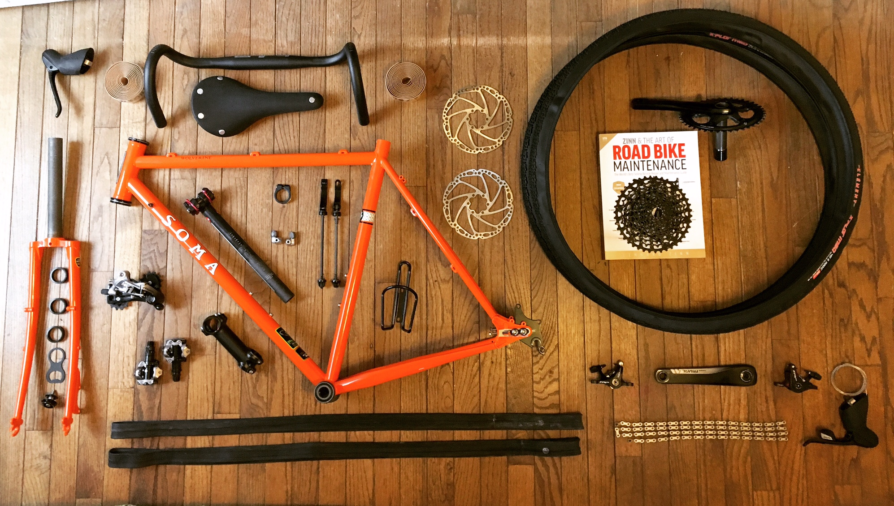

# Soma Wolverine Bike Build
May 2017

Now that I have about 100 miles on my new Soma Wolverine, I thought I’d write a
blog post about my experience building my first bike!

I’d been thinking about building a bike and drooling over the Wolverine for
months (especially after the Bicycle Times review), and then this February I
found someone local who was looking to sell an almost new frame for a bit of a
discount. He’d ordered the frame and built it up before deciding to go for
another size, so he was still riding his own Wolverine but had an additional
spare frame. The only concern was that the frame size is 54cm, and my road bike
is 58cm. I did a lot of research (and documented some of it here), and
ultimately concluded that the 54 would fit me fine.

Once I decided to pull the trigger on the frame, I spent about 6 weeks
researching and ordering all of the other parts. I ordered most of the parts
through my [Local Bike Shop](http://www.bikenetic.com/), and I also got them to
install the headset and bottom bracket. I ended up going with a Sram Rival 1
drivetrain with a 42T chainring in the front and a 10-42 cassette in the back.

The wheels aren’t included in that picture because they were off being custom
built by [Hans](http://snakesthatbite.blogspot.com/) who I met via the local
cycling forum. Hans helped me pick out a DIY wheel kit from BDop Cycling and
built them up for me. I couldn’t be happier with the wheels – especially for the
price!

It took me about 3 weeks to put everything together. I learned a lot in that
process, and each lesson involved an extra trip to talk to or buy something from
the very patient and friendly folks at the bike shop. Unfortunately, I don’t
have many pictures of the build process – but here’s how it looked once it was
all put together:

I had fun with the details: I wrapped the Salsa Cowbell handlebars in Salsa’s
“Glyph” Tape and added a bottle cap from a favorite local brewery to the headset
cap.

The Wolverine frame has bosses for down-tube shifters, but I was using
integrated handlebar brake/shifters and my 1x setup didn’t need a front shifter
at all. I added a cable stop for the rear shifter on the drive side and
installed a bell on the non-drive side (based on the directions [here](#)).

Once the build was complete, I took it out to Rosaryville State Park in Maryland
for a test run. I’d never been to Rosaryville before and it turned out to be not
as smooth as I expected (I’ll look forward to returning with my mountain bike
someday), but the bike handled everything perfectly!

Since then, I’ve taken it on gravel rides on the C&O Canal Towpath, on sandy
rides in False Cape State Park in Virginia Beach, and on flat paved multi-use
trails around Arlington, and it’s handled everything perfectly.

I look forward to putting many more miles on the new bike, and to really put it
to the test this summer with some longer bikepacking trips!
