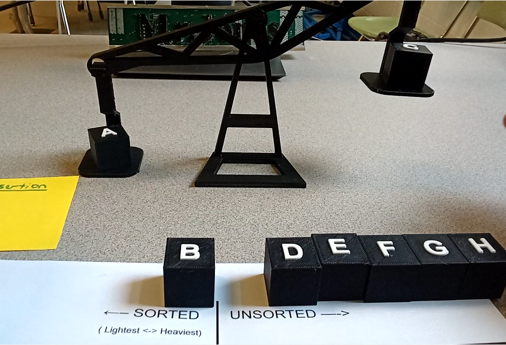

# Sorting Cubes

AP Computer Science A – Unplugged and 3D Printed Sorting Activity
## Background – Teaching APCSA

This year I taught AP Computer Science A for the first time. This has been a
rewarding experience, and it has challenged me as both a programmer and a
teacher. My biggest goal for this class was to make it feel intuitive – I wanted
to make sure that students focused on developing a conceptual understanding of
the course concepts and didn’t get too bogged down by Java syntax. I implemented
a lot of “Unplugged” lessons and tried to let students discover concepts on
their own.

At about the same time, I bought a 3D printer. I’ve loved the experience of
learning about 3D printing and have been studying OpenSCAD and CADQuery. So far
I like CADQuery better – but I’ll write more about that in a separate post.

As we started our unit about searching and sorting algorithms, I realized that
it was going to take some creative instruction to help my students develop
intuitive understandings of each of these algorithms. I found a great unplugged
lesson plan from CS Unplugged. I highly recommend keeping a physical copy of
their book on hand, but their lessons are all posted online too. You can find
their sorting lesson on CS Unplugged
[here](https://csunplugged.org/en/topics/sorting/).

Before this, I’ve used decks of cards to teach sorting, but I’ve found that
students had trouble following the directions – when students can see all of the
cards (or can remember face-down cards they’ve peeked at before), they have
trouble going through the pairwise comparisons in the algorithms. The original
lesson from CS unplugged gets around this by using film canisters filled with
sand and comparing their weights with balance scales. The film canisters are all
visually identical so students are forced to use the scale to compare them.

## Designing and Printing Manipulative For Class

I wanted to use this lesson in my class, but I don’t think I’ve seen a film
canister in the past 20 years, and I was surprised to learn that my school has
no balance scales. This sounded like a great opportunity to use my new 3D
printer. I downloaded and printed a few balance scales from other creators
online before settling on [this one](https://www.thingiverse.com/thing:3742652)
from Build_Something_Amazing on Thingiverse. I liked this scale because it was
simple, rugged, and used relatively little filament (see some of my specific
thoughts about print settings in my comment on the Thingiverse page).

I had trouble finding a good model that we could use for sorting, so I made my
own. I designed a set of 8 cubes that look similar but have different infill
percentages. The weight difference between each cube and the next heaviest is
about 0.5 grams. This weight difference is small enough that students can’t tell
the difference when they hold the cubes in their hands, but large enough that
the scale clearly tells which is heavier. To help students check their work, I
also added a raised letter to each cube. There was a little bit of a drawback to
this decision – students eventually memorized the correct order and found
themselves taking shortcuts once they knew what the answer was. I published my
sorting cubes on Printables [here](https://www.printables.com/).

## Results

I printed 12 sets: each set included a balance scale and 8 cubes, and I made
sure that the sets were all identical (The cubes in each set matched, so cube D
was the heaviest cube in each set, etc). One full set took about 115 grams of
filament, so 12 sets totaled about 1.3kg of filament (which cost me ~$33) and
took 54 hours of printer time.

Before officially teaching any of the algorithms, I followed most of the
instructions in the CS Unplugged lesson plan – I gave students a chance to
intuit and refine their own procedures for operations like finding the heaviest
cube, and sorting the cubes in order by weight. When students shared out with
the class, we found that many students had already intuited algorithms that were
very similar to Selection Sort and Insertion Sort and at that point we just
needed to learn those algorithms’ names!

Finally, at the end of the unit we used these manipulatives for review. I made a
review video and posted it on Youtube [here](https://www.youtube.com/), and
students did a class project where each made their own similar video using
everyday objects like pencils of different lengths.

As a bonus – these scales were fun to fiddle with! I left them sitting out in my
classroom for a few weeks and found that lots of people wanted to play with
them. I ended up having mini discussions about sorting with students who aren’t
in my class, administrators, and volunteers for afterschool programs. These are
exactly the kind I conversations I love to have as I work to encourage more
students to sign up for my CS classes.

I’m very happy with how these lessons turned out, and I believe that my students
have a better understanding of these algorithms because they started by
exploring and discovering the ideas on their own. I hope these resources will be
helpful for other APCSA classes in the future!
