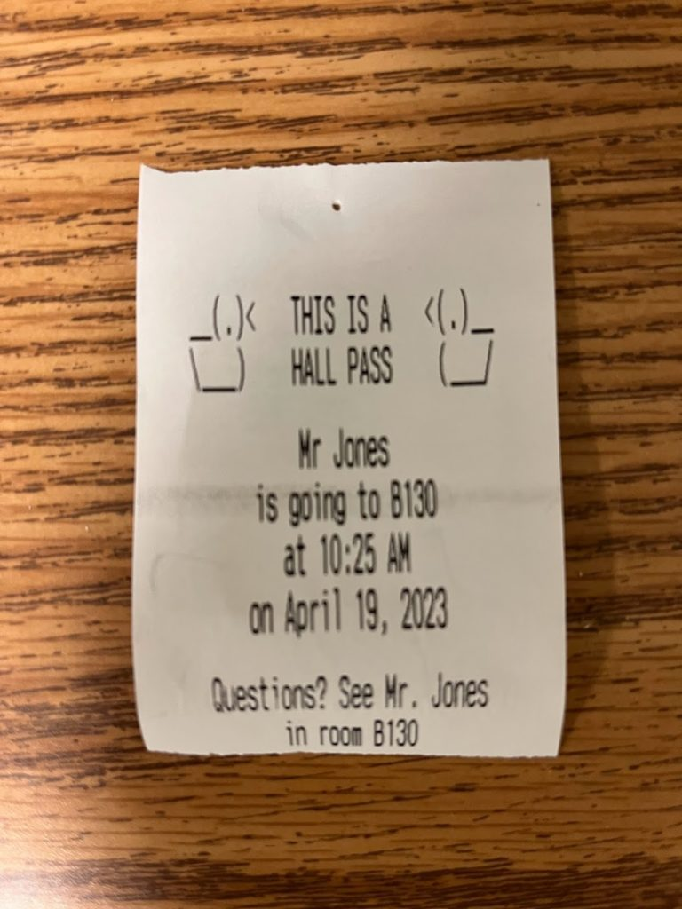

# Hall Pass Printer
May 3, 2023

## Background

I teach at a public high school in Virginia. Our school has a paper hall pass system that doesn’t always work as well as we hope. Here are a few of the major challenges that we had:

- **Theft**: We have major issues with students stealing (and sometimes selling) blank hall passes. So even if a student is in the hall with a filled-out pass, we have no way of knowing that it’s real.
- **No record**: Students often ask to go to the bathroom, get a hall pass, and then never come back. Unless I hand-write a second copy of every pass for myself, I have no record of what time the student left or how long they are gone. We tried asking students to sign a sign in/out sheet, but it was rarely helpful.
- **Disruption**: Writing hall passes is disruptive. I spend a lot of class time working 1-on-1 with students, and every time a student needs to leave the room, I would need to pause the student I’m working with, go back to my desk, and fill out a hall pass.

There are already plenty of teachers advocating for a district-wide electronic hall pass system (like e-hallpass or SmartPass), but I knew that I could make my own solution. This project also gave me an opportunity to learn and practice with a Python library that I planned to share with my students. And as an added bonus, my students love it – they think the receipts are fun, and have asked me lots of questions about how it works.

## The Solution

I call my web app **D.U.C.K**, which stands for “Digital Unified Classroom Keeper” and is a reference to “rubber duck debugging” (I also have rubber ducks and duck-themed decorations all over my classroom). Students load this web app from their phone or computer and make a request for a hall pass. From my phone or computer, I can approve the request, and then it automatically prints the pass for them. Here are some pictures:

- This is what the hall pass looks like. It includes all the same information from the paper hall pass.

- Here’s what the printer looks like right now. Originally, I had the Raspberry Pi and the breadboard all crammed into the cardboard box. Students kept asking me how it all worked, so I ended up “dissecting” it and sticking those parts to my bulletin board. I’d love to eventually come up with a better housing that would contain everything and still make the components visible.

- Here is one of the menus on the student front-end. It’s simple, but it contains everything they need to request a pass.

- And here’s what I see. (The names you see in the screenshot are fake.)

At the end of each day, the system generates a log of all the passes it printed that day and then wipes the database. I keep these logs in a desk drawer and refer back to them any time that I have attendance questions.

## How I Made It

- **Raspberry Pi**: The website is running on a Raspberry Pi connected to a thermal receipt printer. I got the printer from Adafruit (here), and they have tons of great documentation and starter code to handle the printing.

- **Python and Flask**: The web app is written in Python and based on Flask, a popular Python web framework, and I gave it a simple Bootstrap front-end. I had already agreed to act as a “consultant” for one of my students who was doing a year-long project using Flask, so this project was my excuse to learn Flask. It was the perfect tool for the job, and I loved working with it. The web app uses a Sqlite database on the Raspberry Pi, which I manage with SQLAlchemy.

- **Front-end Design**: I created two front-ends, one for students that doesn’t require any login, and an admin front-end for myself that I login to using my Google login. OAuth was also on my list of things to learn, and I found this tutorial from RealPython super helpful.

You can find all of my code on GitHub [here](https://github.com/MrJonesAPS/Duck).

## Reception

I’ve been very happy with how helpful this system has been. My students noticed that I can approve from my phone quickly and without interrupting the class, so they’ve almost entirely switched to requesting hall passes with this system.

The system isn’t perfect – because students don’t need to login, I do get some “spam” requests. They’re easy enough for me to reject.

I have lots of ideas for features that I’d like to add – my next plan is to add a help queue, inspired by ClassroomQ.
